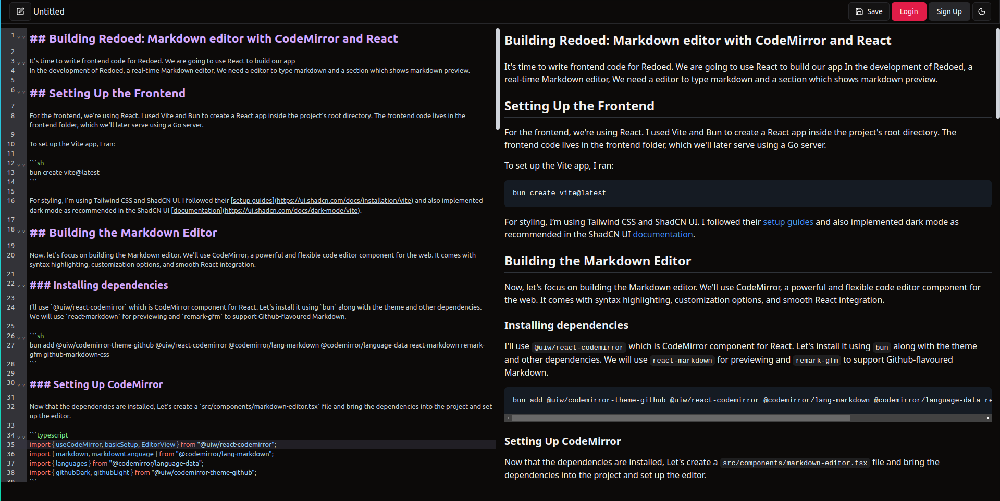

## Building Redoed: Markdown editor with CodeMirror and React

## Creating a React App with Vite and Bun

For the frontend, we are going to use React. I chose Vite and Bun to set up the React app inside our project’s root directory. The frontend code will live in the frontend folder, which we will later serve using a Go server

To set up the Vite app, I ran:

```sh
bun create vite@latest
```

I am also using Tailwind CSS and ShadCN UI for styling, so I followed their [guides](https://ui.shadcn.com/docs/installation/vite) to set everything up, including implementing dark mode as guided by ShadCN UI [documentation](https://ui.shadcn.com/docs/dark-mode/vite).

## Building the Markdown Editor

Now, let's focus on building the Markdown editor. We'll use CodeMirror, a powerful and flexible code editor component for the web. It comes with syntax highlighting, customization options, and smooth React integration.

### Installing dependencies

I'll use `@uiw/react-codemirror` which is CodeMirror component for React. Let's install it using `bun` along with the theme and other dependencies. We will use `react-markdown` for previewing and `remark-gfm` to support Github-flavoured Markdown.

```sh
bun add @uiw/codemirror-theme-github @uiw/react-codemirror @codemirror/lang-markdown @codemirror/language-data react-markdown remark-gfm github-markdown-css
```

### Setting Up CodeMirror

Now that the dependencies are installed, Let's create a `src/components/markdown-editor.tsx` file and bring the dependencies into the project and set up the editor.

```typescript
import { useCodeMirror, basicSetup, EditorView } from "@uiw/react-codemirror";
import { markdown, markdownLanguage } from "@codemirror/lang-markdown";
import { languages } from "@codemirror/language-data";
import { githubDark, githubLight } from "@uiw/codemirror-theme-github";
```

CodeMirror supports syntax highlighting via `HighlightStyle`. I defined a highlight style for Markdown headings to make them standout.

```typescript
import { HighlightStyle, syntaxHighlighting } from "@codemirror/language";
import { tags as t } from "@lezer/highlight";

const markdownHighlightStyle = HighlightStyle.define([
  { tag: t.heading1, fontSize: "2em", fontWeight: "bold" },
  { tag: t.heading2, fontSize: "1.75em", fontWeight: "bold" },
  { tag: t.heading3, fontSize: "1.5em", fontWeight: "bold" },
]);
```

We'll make the editor's background transparent so it blends in with the site's theme.

```typescript
const myTheme = EditorView.theme({
  "&": {
    backgroundColor: "transparent !important",
  },
});
```

## The Editor Component

The core of the editor is built within a functional React component. It uses `useState ` to store the Markdown content and `useCallback` to handle text changes. Here, we are also using `useTheme` hook to get the theme information to make sure the site theme also applies to the editor.

```typescript
import { useCallback, useState } from "react";
import { useTheme } from "./theme-provider";

function Editor() {
  const { theme } = useTheme();
  const resolvedTheme =
    theme === "system"
      ? window.matchMedia("(prefers-color-scheme: dark)").matches
        ? "dark"
        : "light"
      : theme;

  const [value, setValue] = useState<string>("# Welcome to Redoed!");
  const handleChange = useCallback((val: string) => setValue(val), []);
```

## Initializing CodeMirror

Now that we have the theme, syntax highlighting, and state set up, it's time to put it all together. We'll use `useCodeMirror` to create the editor and apply everything we've configured so far.

```typescript
const { setContainer } = useCodeMirror({
  value, // Uses the state we set earlier to store the Markdown content
  height: "90vh", // Sets a fixed height for the editor
  extensions: [
    basicSetup(), // Adds essential features like line numbers and bracket matching
    markdown({
      base: markdownLanguage, // Enables Markdown syntax support
      codeLanguages: languages, // Adds syntax highlighting for code blocks
      addKeymap: true, // Enables useful keyboard shortcuts
    }),
    syntaxHighlighting(markdownHighlightStyle), // Applies our custom Markdown styling
    EditorView.lineWrapping, // Enables line wrapping
    myTheme, // Uses our transparent background theme
  ],
  theme: resolvedTheme === "dark" ? githubDark : githubLight, // Adjusts the theme dynamically
  onChange: handleChange, // Updates the state when the user types
});
```

The last step is rendering the editor by attaching `setContainer` to a `div`, which gives CodeMirror a place to mount itself.

## Rendering the Markdown Preview

Now that the editor is set up, it's time to display the rendered Markdown. I'll use ReactMarkdown to convert the Markdown text into HTML and remark-gfm to support GitHub-style extensions like tables and strikethroughs.

```tsx
import ReactMarkdown from "react-markdown";
import remarkGfm from "remark-gfm";
import "github-markdown-css";

return (
    <div className="w-screen sm:grid sm:grid-cols-2 py-2">
      <div>
        <div ref={setContainer} className="border-r-1" />
      </div>
      <div>
        <div className="h-[90vh] markdown-body p-2 markdown-preview overflow-y-auto scrollbar hidden sm:block !bg-background">
          <ReactMarkdown remarkPlugins={[remarkGfm]}>{value}</ReactMarkdown>
        </div>
      </div>
    </div>
  );
);
```

This layout keeps the editor and preview side by side on larger screens while keeping the UI clean. Any text typed into the editor instantly reflects in the preview without needing a manual refresh.

## Adding a Header component

Let’s also create `header.tsx` and add this code. For now, it’s just for the show, with none of the buttons working, but it will evolve later.

```tsx
import { Save, SquarePen } from "lucide-react";
import { ModeToggle } from "./mode-toggle";
import { Button } from "./ui/button";

function Header() {
  return (
    <header className="bg-background flex h-12 w-screen items-center justify-between border px-4 py-2">
      <div className="flex items-center gap-1">
        <Button variant={"outline"} className="cursor-pointer">
          <SquarePen />
        </Button>
        <div className="w-25 sm:w-auto">
          <p className="truncate font-medium">Untitled</p>
        </div>
      </div>

      <div className="flex gap-1">
        <Button className="cursor-pointer" variant={"outline"}>
          <Save />
          Save
        </Button>
        <Button className="cursor-pointer">Login</Button>
        <Button className="cursor-pointer" variant={"secondary"}>
          Sign Up
        </Button>
        <ModeToggle />
      </div>
    </header>
  );
}

export default Header;
```

## Putting Everything Together

Now that we have both the Editor and Header components, let’s bring them into `App.tsx`.

```tsx
import Editor from "@/components/markdown-editor";
import Header from "@/components/header";
import { ThemeProvider } from "./components/theme-provider";

function App() {
  return (
    <ThemeProvider>
      <main className="h-fit">
        <Header />
        <Editor />
      </main>
    </ThemeProvider>
  );
}

export default App;
```

To start the development server, run:

```sh
bun run dev
```

Here's how the Markdown editor looks in action



Here's how far we've progressed in Redoed up to this point: [GitHub - ui-md-editor branch](https://github.com/heshify/redoed/tree/ui-md-editor)
